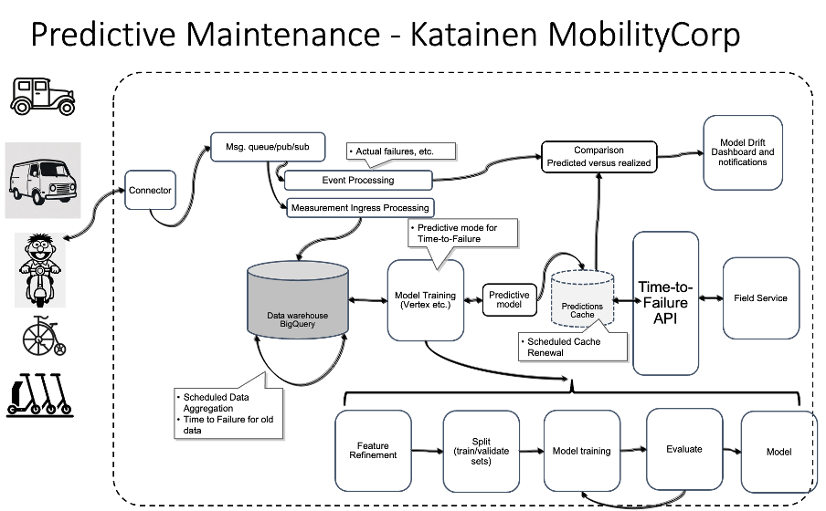
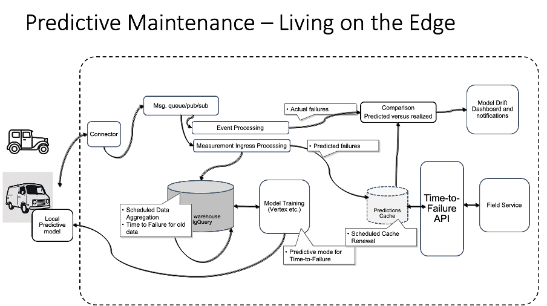
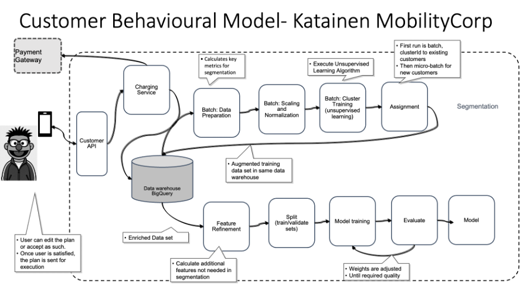
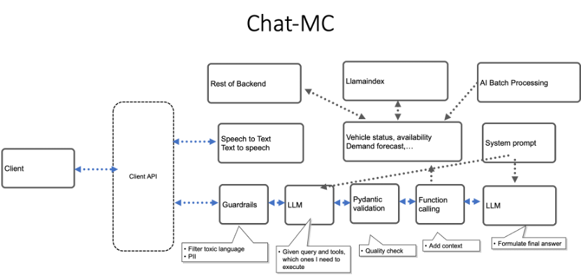
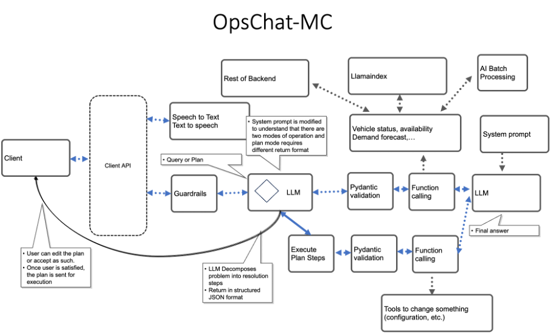
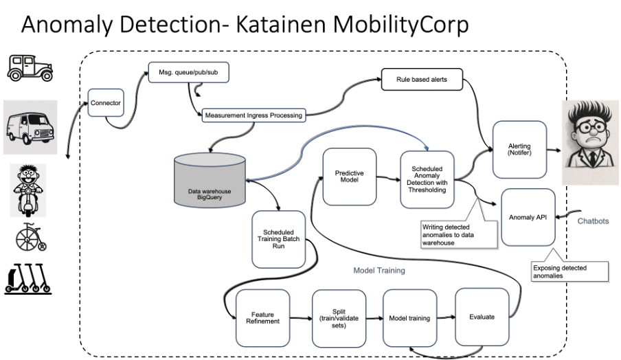
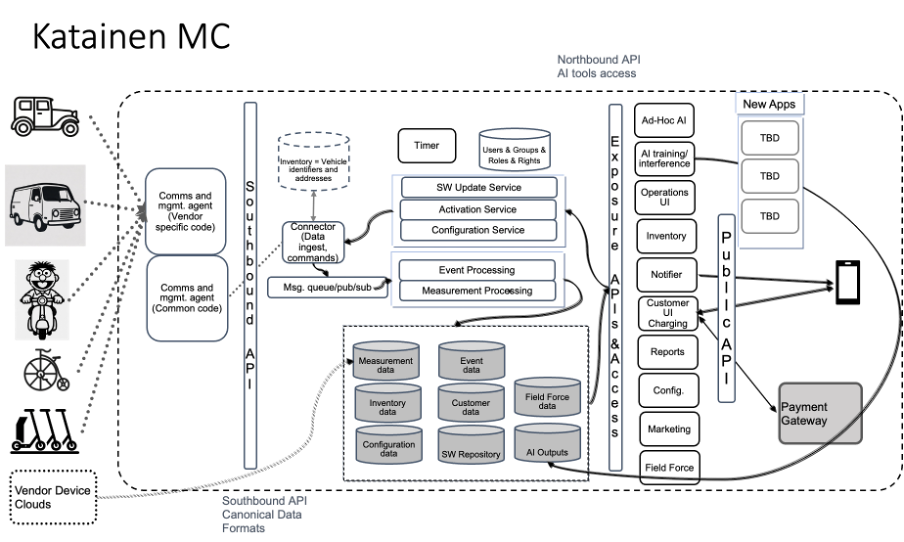
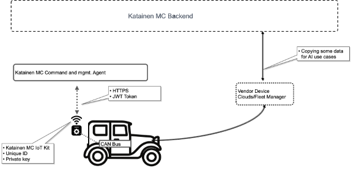
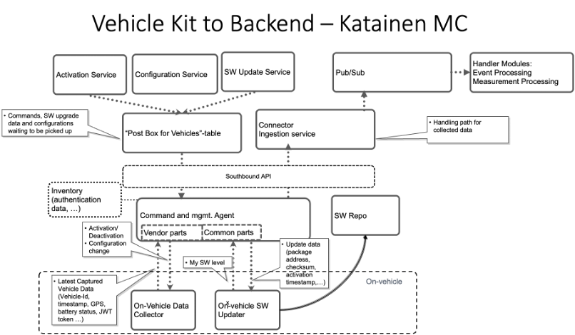
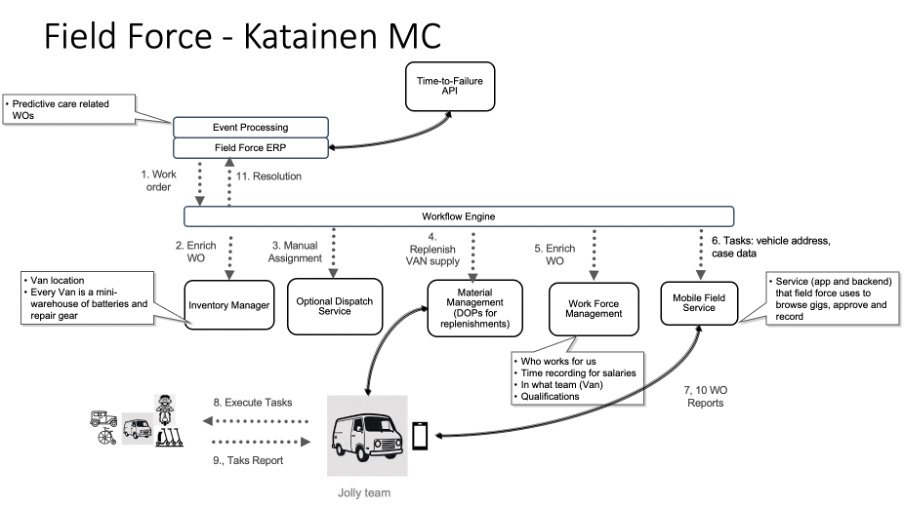

# Introduction

This repo represents quick answer to O’Reilly Architectural Katas 2025: AI-Enabled Architecture.

It’s about a mobility company renting electric cars, vans, scooters and bikes by hour (vans and cars for longer duration). Exact specs omitted.

Three key questions or success criteria were mentioned:

The three key issues and hence success criteria for the work where:

* Can we anticipate customer needs/when people want to use service?
* How to priotize which vehicles to swap out batteris first (bikes, scooters).
* Right now, most of our customers just use them on an ad-hoc basis - we’d like more of them to rely on our fleet for regular trips like daily commutes

## Overview of AI Usage

For the battery swap issue, a predictive model for equipment is proposed. Process works both for predictive care (when things go pear shaped) as well for batteries (out-of-juice situation) just with own models (for each key component that can break as well for batteries). It consists of found main parts: 1) capturing data first (collect, validate, make into canonical format and to data warehouse) and 2) then actual training pipeline with calculating additional features from raw material, splitting into training and validation, model training, evaluation until model is declared ready, 3) usage where model is available via API that uses cached, precalculated results, 4) comparing actual realized events against what the model predicted to monitor model degradation.

For anticipating customer needs a customer demand model is proposed. The model predicts for each vehicle type demand on each docking/charging station on hourly basis. The main change is to segment users first into groups (each user gets assigned ClusterId) and then flagging all training data with right ClusterId before doing the actual predictive modelling.

For incentivizing users to be regular commuters (for work etc.) for-uptake model is created. Its one of the customer behavioural models. For the training we naturally need training data sets that can be only created by first thinking of different incentive schemes to convert people to daily users and then based on that, do the training and monitor how well these models work in the wild. Different customer segments are likely to take up different promotions. The clustering of users will most likely be different than for demand.

None of these models needs generative AI. It becomes relevant when we add a chatbot to the mix. Two/three different chatbots are proposed:

* One for users where they can ask about service, availability of vehicles, pricings etc.
* Another for operational staff where they can question state of the network and as the genAI to generate plans how to fix problems
* Third one for management where they can query about anomalies on the system (are there usage anomalies at the moment and how would you describe their nature?). Ultimately, we want to allow users to ask “Identify anomalies in fleet and their most likely causes”

GenAI can also be used to generate ideas for promotions to incentivize customers to increase usage. These concepts are then validated by marketing. GenAI can also generate a lot of different wordings (ways to present the same offer) so that we can see which text works best for each customer segment. These are also pre-screened by humans before usage.

Caveat Emptor: It seems I did not read the memo carefully (who has time in this hectic modern era of ours anyways and started with a breath first approach: whole architecture -> how AI fits. When starting ADRs I realized the focus probs should’ve been more depth first (explain why I chose K-Means instead of xyz).

# Select AI Use Cases

## Predictive Maintenance and Battery Swap

*Figure 1. Predictive Maintenance Architecture*

Data flows from the vehicles via the vehicle IoT Kit (described in more detail below) to the device agent and via it to connector service that writes it to pub/sub service. Different services pick relevant data for them (event processor(s) events and data processor(s) incoming measurements). Measurements are written to a data store (Big Query).

The data needs aggregation over a fixed time window (e.g., 1 hour or 1 day) to create meaningful features for AI. Typically needed features include telematics data on usage (odometer readings, trip duration, trip count), stress data (accelerometer, hard braking events, RPM), environmental (location, temperature, time of day, day of week, raining, icy road etc.), component data (Error codes, battery degradation rate (initial capacity} - current capacity), frequency of error codes (error codes from same component frequenty), vehicle details etc.

This is done via scheduled batch jobs and results stored to same data warehouse.

We want to train for each important component own predictive model based on this past history. Models to predict time-to-failure or in case of battery swap model (time-to-empty-battery), to predict when battery runs out of charge.

The training is done using for example Vertex AI if on GCP.

Clients use the model via a Client API. One of the main users for time-to-failure is field force, where the ERP can create work orders before faults happen (see below more on field force architecture).

To speed up the Client API, we want to pre-calculate results regularly as tear and wear tends to happen slowly. There is a batch job that uses the created model and populates a low-latency cache for results and the Client API just pulls results from this in-memory store.

Sometimes the predictive model is wrong and something breaks before the predictions think. For this case we need a comparison service that reads fault events from pub/sub and compares timings with what the model thinks. Discrepancies are aggregated and presented in the Operations Center UI. Administrators can then take appropriate actions if the model performance starts degrading.

### ADRs
[predictive maintanance ADRs](katainen-adrs.md#predictive-maintenance-adrs)

### Future direction - Edge Execution

****

*Figure 2. Predictive Maintenance on the Edge*

As an economically prudent company, Katainen MC is looking for ways to reduce costs. One option is to move interference to the edge.

One thinks easily that for cost reasons the IoT kit at vehicles needs to be simple. The opposite can also be possible. We could add a GPU to the IoT kit and think about loading some AI models to be executed on-vehicle. This makes sense in the case for cars and vans.

The architectural change is not too complex. The model is downloaded to the vehicle (car, van) that is beefed with GPU and results are emitted as events/data from the vehicle using normal routes.

We still want to cache results for the predicted time-to-failure but it makes no sense to report this frequently if everything is shipshape. Local models could send this perhaps once a day, only report when time is within configured limit (say within next month a fault is expected to happen) or when battery discharges much faster than last reported. Comparison works as before.

### ADRs
[Edge Executionn ADRs](katainen-adrs.md#edge-execution-adrs)

## Predictive Demand Models

Same architecture for training predictive models based on time series of existing data can be used for many other use cases such as. Let’s discuss demand models

Features can include for example historical usage data, time of day, day of the week, weather forecasts, traffic, and local events. The last one would require feed from external sources what type of large gathering (fairs, world-class artist visits, in general number of smaller events coinciding) to be available.

This can be used to build models on overall demand and more fine grained model for demand for each different vehicle types in any given area to docking stations level at hourly level. This solves one of the essential questions that MC as an organisation has.

These models then provide input data to various marketing and dynamic pricing models.

## Range prediction

Same architecture again for range prediction based on charge, weather, rental time and city traffic prediction. Range prediction can be made at customer level possibly if we have customer driving from past usage. First there needs to be a generic model and then customer past behaviour can be used to finetune it. This might however be too costly or make the architecture more complex with relatively little improvement.

The time-to-empty-battery model alone goes a long way to solving another MC’s pressing issues: How to prioritise which vehicles to switch out batteries? (for bikes and scooters). It can be improved by combining information from demand model and range prediction. If in a given area high demand is expected and batteries are not quite at end, as long as customers see the status and predicted travel distance available, people with short needs can still utilize our fleet.

## Customer Behavioural Model

Customer Behaviour Prediction (predicting user action) requires some modifications, particularly in modelling approach and naturally the features and labels will differ. We want to be able to predict at least when they are most likely to use the service (weekday, weekend, time of year) and to what types of promotions they would be most likely to take up.

It makes sense to segment users to user segments before building predictive models. This is done with unsupervised learning. Segmenting allows to build more accurate and specific models for each segment, leading to better results.

Typical features are time dependent (day of week, hour of day, time of last service use, time since last login etc.), context (location type = beach, city centre, weather, local events/holidays, season, even competitor promotions), user data (demographics, how much consumed so far, how recently, what option(s) they use (car, scooter,…), how often)

Architecture is shown in diagram below.

****

*Figure 3. Customer Behavioural Model(s) Architecture*

The process consists of two phases: segmentation and actual model training

Segmentation starts with the raw data about user behaviour. First step is to calculate key metrics needed in clustering (like per event the time-to-next purchase). The calculated values are then scaled and normalized (typically to values between 0 and 1 to prevent any feature with large value to dominate outcome), then unsupervised learning algorithm like K-Means is executed. This defines the number of clusters and generates the final model. Last step is to use the trained model to assign a clusterId to every customer and then populate all rows in data with clusterIds depending from which customer that data originated. The assignment is done by finding the closest cluster centroid for each user (closes point in multidimensional space).

Last part is training the model.

It starts from the enriched data set is taken and additional derived features are calculated that were not needed in segmentation. Next data set is split into training data and validation data. Validation data is used to evaluate how well the trained model performs when it sees data that it has not seen before (not used in training).

Next model is trained using the training set and after that validated using validation data. Backpropagation is used to recalibrate weights in the model until validation reaches required quality. The final model is ready to use.

The model is then used in similar manner to the predictive care example.

Quite a few customer behaviour models can be created in this manner

* Time-to-next-use. How long will it be until this customer uses us again if we do nothing
* For-uptake-customer-per-promo. For each promotion, model predicts (0,1) if customer is likely to take up. E.g., they are likely job commuter (morning and late afternoon). How likely they are to take up a lunch time promotion
* At-risk-customer. One’s that are likely to churn to competitor
* Fraudulent-customer. How likely this user is attempting fraud

For-uptake-customer-per-promo can be used to find customers most likely to convert to daily commuters.

### ADRs
[Customer Behaviourals Model ADRs](katainen-adrs.md#customer-behauvioral-model-adrs)

## Customers’ Conversational AI Chatbot

Purpose of this chatbot is to answer customer questions about the service and current status of the vehicles and service in general (how busy it is etc.) You can interact with it using either text or speak to it.

*Figure 4. Customer Chatbot Architecture*

Mobile app is the user interface. User either types or speaks the question. User audio goes to its own /transcribe API where speech recognition is performed and text returned to user. User can correct mistakes before submitting

Queries are handled by a processing path.

* System prompt has been given at the beginning as general guide and policy on how the system behaves.
* Quardrails.ai is used to weed out toxic queries and remove personally identifiable information
* The cleaned query is given to a AI model with a set of tools that can be used to gather additional information needed to answer the question, each tool contains description of when it should be called
* LLM decides what tools are needed to answer and return a list of functions with parameters.
* Each function call gets vetted using pydantic that the parameters are valid
* Main functions include llamaindex where all textual material about service, vehicles, locations is indexed. Those queries should land there. AI Batch Jobs have been run prior to make various predictions of near future, for example about expected demand in each area per hour. If customer is interested in results of particular predictive model => function about that should be called. There are several other backend data items that may make sense in future, the tool list is expandable.
* Functions get called and additional context is built.
* Finally, AI model is passed the full set: system prompt, user query, additional context data. LLM formulates the final answer that gets returned to user

## Experimental

In order to save money, Katainen MC may think of moving some behavioural models to the consumers phone (avoiding to need to run them in the cloud costing money). This would need to be opt-in as most users guard their phone battery with near religious zeal. Still, this would allow the consumer to chat with Katainen MC asking for example “make me an offer I can’t refuse,…, no,no,no,no, make a real offer, …” or “tell me the route I was driving last Thursday” (as text listing street addresses at measurement points). Whether this would be worth it, I’ll leave to the capable hands of the upper management.

### ADRs
[Conversational AI-Chatbot ADRs](katainen-adrs.md#conversational-ai-chatbot-adrs)

## OPS Center Chatbot

Same concept is applicable to operations centre where people manage the fleet. Here they use the system to make queries about the state of the system or individual vehicles. As additional the operational staff can ask the system to make a plan for solving a particular problem. The plan is not immediately executed but the staff can review and edit it before submitting to execution. This also means that it has some additional tools at its usage for making the change. Otherwise, it is similar to the previous system.

*Figure 5. Operational Centre Chatbot Architecture*

System prompt is augmented to differentiate between PLAN and QUERY modes and to return plan in structured format to user. As the chatbot now makes changes to the external environment, it is essential that user role and rights are checked before tools are executed.

User interface is augmented so that user can accept/reject or edit the plan. When submitting again, code handling the plan iterates over it (this is not in LLM, but coded as a “driver” for plan). Plan is executed in similar manner but some tools are added to actually affect the state of the system (config changes for example). Results are added to context and finally a LLM is used to formulate final response.

### ADRs
[Operations Center Chatbot ADRs](katainen-adrs.md#operations-center-chatbot-adrs)

## Anomaly detection

****

*Figure 6. Anomaly Detection Architecture*

The chatbot becomes more useful when we add anomaly detections to the mix.

A bunch of different anomalies can arise such as:

* usage — unusual trip volumes, sudden spikes/drops in usage for a vehicle type / region / time-of-day (indicates demand shifts, fraud, or booking engine issues).
* Operational — unexpected increase in incidents, break-downs, maintenance flags, or sensor telemetry outside normal operating envelope.
* Realtime vehicle health anomalies — per-vehicle telemetry drifting (battery, temperature)
* Business KPIs anomalies — bookings, returns, cancellations, revenue.

These are most important to marketing and management. They can have their own chatbot or the operational center one uplifted.

The core idea is to establish what "normal" behavior looks like and then identify deviations from that norm. There will be multiple models.

Anomalies are best handled as soons as possible. A simple first step is that once we have seen some anomalies, we analyse how the anomaly started and progressed and create simple rule based filtering as part of the standard event processing service to quickly detect it and flag for operational dashboard. All alerts are also written to the data warehouse and exposed via an API. This API can be then used by a LLM tool to make queries whether and what type of anomalies are in the network,

For the batch processing the flow can be as follows:

* Data is collected as before to a data warehouse
* Actual model building follows already seen pattern.
* Starting with feature creation where for usage: time-series features, e.g., hourly rentals per vehicle type, rental frequency per user/vehicle, distance per hour or daily incident counts, for failures rolling averages (e.g., 7-day incident rate), ratios (e.g., failures per rental), etc.
* We use unsupervised models as anomalies are rare (we have no or very few examples).
* The models are then executed for example daily or as micro-batches more frequenty. Thresholding is added so that MC can define what type of deviations are defined as “anomalies”
* When an anomaly is detected, its good to act quickly so notifications are best published both to operations center dashboard/anomaly table in data warehouse as well sent to a dedicated slack channel or whatsapp group etc.

### ADRs
[Anoomaly Detection ADRs](katainen-adrs.md#anomaly-detection-adrs)
# Katainen MC (pertinent) architecture

(achtually almost full architecture as I misread the memo in the beginning and started working breath first …)

The high-level architecture of the system is in the diagram below:

*Figure 7. High-level Mobility Corp Architecture*

Main components:

* Vehicles have IoT kit for data capture and communicating it towards the MC backend.
* Customer use mobile app to interact with the backend
* Charging Service is responsible for all charging related aspect
* Successful reservation leads to a request to the Activation Service that records the status for the vehicle to pick it up. Final unlocking of vehicle and docking station happens when customer is at the vehicle and uses NFC link.
* Returns are initiated via the mobile app, go to Charging Service for settlement and from there via Activation service to lock door/van door and for scooter/bike the docking station.
* Notifier sends notifications and emails to customers and emails to stakeholders
* Payment gateway is an external service that handles credit card transactions
* Administrators use Operations UI for tracking vehicle and IoT Kit status
* Configurations are made in Operations UI and the request handled by Configuration Service. Finally change request is stored to wait for vehicle to pick it up.
* Software updates to IoT kit are handled by Software Service and they also start in Operations UI
* Inventory stores all vehicles, addresses and information about them. Different processes manage different parts of the inventory data
* Timer detects if some vehicle is in non-communicating state
* Marketing service is used for campaings etc.
* Field Force service handles field force operations using a workflow engine and a bunch of services described later
* Ad-hoc trials with AI training using BigQuery tools
* AI training and Model Interface

Internal processing for incoming messages

* IoT Kit protocols are terminated on Comms and Mgmt agents that implement protocol between vehicle IoT Kit and backend. There is common part and protocol part allowing several protols and vendors in future
* Rest of the architecture talks with devices using southbound API
* Connect module handles data ingestion and passes it forward to a message queue
* Various processing agents read it from the message queue and process

Internal process for reservations

* Reservation starts with the mobile phone that is handled by the Charging Service leading to Activation Service recording successful status waiting for the vehicle to connect next time. Actual service is started only when the user is at the vehicle and uses the NFC communications to unlock the docking station or door to the car/van.

Rest of this part we work through different main components

## Vehicle IoT-Kit

*Figure 8. High-level Vehicle IoT-Kit Connection Environment*

Each vehicle we have small vehicle-module (IoT) to tracks location, connects to the vehicle interface (e.g. CAN-bus in cars and vans) to capture data and reports it to the backend service. They also can receive commands for example to update the kit software itself or enable or disable the vehicle.

We expect that car and van vendors at least to have their **own device clouds**/fleet management software with much more sophisticated data available. Some of that we want to copy for future AI use cases. Subject to negotiation.

The **vehicle kit always initiates communications towards the backed**. If incoming traffic were allowed, it would become a target for intruders and sooner or later firewall functionality would be needed. Result: added costs and reduced security.

Each device is **uniquely identified**. There is EU regulation (EU Cyber Resilience Act for the legal enthusiasts) if effect since 1st of August manufacturers in EU must ensure that radio-connected devices among other do not use universal default passwords and implement unique access credentials (e.g., per-device password or secure onboarding). This applies to consumer devices only but common sense dictates we need to do the same.

IoT devices do not typically have eSIMs and our assumption is that neither does our kit. To prevent theft of SIM, the **physical SIM needs to be glued** and ideally (if available) the operator may provide binding between the SIM card and the device.

When energy supply seems to be dying (vehicle battery out and on-board battery near end, the kit needs to send its last known location and “I am going down, down, d…” message to backend (**dying gasp**) so that field force can try to return it back for recharge or repairs.

Other unexpected events to generate include for example detection of collision of the vehicle (through reading accelerometer data via CAN bus) etc.

Our kit will be running some operating system suitable for IoT devices like Zephyr or FreeRTOS that provides **real time clock** to applications. These will ultimately get the clock signal from GPS. There is currently almost constant GPS jamming in large parts of Europe affecting clock synchronization. For the time being we assume that existing support for the OS is sufficient and there is no need to start building some kind of own service. As a side note at least in principle 5G networks could provide time synchronization as well albeit support (network or chip) is not widely available.

The vehicle module uses almost certainly a micro controller as these are much cheaper and use less energy than full CPUs. The module houses a key that needs to be stored securely. Unfortunately, MCUs do not have similar secure enclaves and having separate chip (TPU) would add costs probably too much. However, several modern MCUs designed for IoT now include integrated security features that act as a secure subsystem. We assume that such as solution (**Soft Enclave**/key wrapping) is available.

### Combined Kit Architecture

The general architecture of vehicle kit communicating with the backend is in the diagram below:

*Figure 9. Vehicle Kit integration architecture*

For communications we use HTTPS and JWT. A device uses its private key (stored securely on the device) to sign a JWT that contains device’s unique ID and an expiration time. This token is attached to each request to the backend.

At initial outset we define the protocol to all vehicle IoT kits. However in future we want to use commercial components, that’s why ideally protocol handling is split to a common driver and protocol depenant part.

Data stored on backend is always in **canonical format**. Canonical = our own internal standard for storing each category of data in same units (like power in Watts not kiloWatts, distance in meters etc.). We may in parallel and certainly over time use vehicles (cars, vans) from multiple vendors that likely internally represent data differently. Canonical format equalizes them and makes upstream code simpler.

At regular intervals (say 30 sec) the kits send latest data to the MC backend. As return value it may receive instructions. These can include configuration changes, command to unlock or lock certain bay at the docking station.

A separate process on the kit for **SW updates** works similarly to update the data collector. At regular intervals (say once 5 minutes), it contacts backend and may receive information about a SW update to fetch. We split the design to two parts so that SW updater is as simple as possible: to periodically query if a software update is available, download it, verify consistency of download and finally install. This is such a simple functionality that the need to update it is very seldom, hopefully never. Any uploaded software may contain errors that prevent the new version from starting. If this happens to data collector, the SW updater can again pull a corrected version as they are not bundled.

A beefier solution would be such that there are two partitions on hard dive and the firmware of the system can detect if bootup fails and returns to a partition that failed. We assume the this is in place (**A/B partitioning**).

### Process

The process is roughly as such:

* At regular interval the kit contacts backed to report collected data
* Collector receives it, validates token and incoming data, turns incoming data into canonical format and puts to a pub/sub queue to be picked up by future processing modules.
* Processing modules end up writing data and any other information created into a database (Big Query on GCP).
* Any upper-level process wanting to pass information to the vehicle kit will write information to a “post box table”. This will be picked up by the collector and sent as reply to the vehicle kit that then implements the needed action.

## Backend services

### Ingestion service

The ingestion service is part of the connector and it communicates with the common part of the device agents using standardized interface – Southbound API. In future new agents can utilize this and place their logic either on-device or on the cloud.

As there are multiple agents, the ingest service is realized by multiple connector containers that are scaled by the underlying cloud platform. The ingest service receives data and writes it out to a message queue to be later picked up by one or more processing services.

The ingest service connector can validate (again) incoming data (missing parameters, does the recorded value make sense), filter out some values etc. depending on evolving needs.

### Event Processing

Event processing is a container that reads incoming events (dying gasp, battery temperature over the alert limit) and performs needed logic. Often this involves communicating with the user using the notifier. Sent notifications are also stored in the online analytical processing data store for further analysis (did the user respond and what was the response.

Events that have charging impact are read directly by the Charging Service (see below).

### Measurement Processing

A separate service (container) reads data from the message queue and writes it to the OLAP data store (Big Query). There may be need to do some processing in the future, but based on project brief, none identified. This would be the place to implement if for example some more extensive validation, “smoothing” of incoming data or pre-aggregation would be needed.

### Configuration Service and guaranteed, ordered execution with error handling

Configuration changes towards the vehicle-kit can include commands like re-defining the parameters to be collected (adding or removing some params), changing reporting address or reporing period.

The configuration requests originate in the operations service where administrators select a group of devices and define the change. The request is expanded to target each device separately (for simplicity). The request for configuration change is written to a table containing target devices and change data, waiting to be picked up (we call this “post box”). Reason is that we have a pull mode for all communications from devices.

We want execute all requests towards that device in order they originally were received even when sometimes execution may fail as a device may be off-line etc. This to avoid wrong end results (say we first define one set of params to fetch but later add something to it, if we did not preserve order, the addition would be lost).

When device has gotten its change data, we mark the row as “delivered”.

### Non-communicating vehicle

The error scenario here is one where the vehicle never contacts us. This will trigger error process. To implement that we need a scheduled process (timer/time-snitch) to find out lost vehicles.

For locating the missing device there are two options: use network APIs provided by carriers (CAMARA seems to be becoming popular but most likely not available everywhere) and if the vehicle is rented out, use the mobile app for locating at least the renter and perhaps sending them a notification or calling to enquire on the state of the vehicle. Finetuning the right policy is left for implementation and operations phase.

For now we just assume an event is created for Operations UI to notify a person of non-communicating vehicle.

### SW updater

Software updating happens again in similar manner. People in operations center place the new image into the directory where all versions reside and define updating parameters (like which devices this update is directed for, when the update should be installed, checksum for the file etc.).

Most updates are tested first with a small set of devices near the Mobile Corp head quarters or other offices. Only when update seems stable, the update is approved for the whole fleet.

Updating happens so that the vehicle-kit gets data about a new sw update to be fetched. This data contains address and other data needed for fetching it as well activation timestamp when it should be installed. This allows vehicles to download files well in advance. Protocol for downloading HTTPS and file to be signed with MC private key, IoT kit needs the public key. Checksum in addition to protect against download corruption.

Actual fetching on-device is done by a separete process that is made on purpose to be as simple as possible. After fetching and signature check + checksum passing, it sets a flag of successful delivery. Its up to implementation team to decide fine details between these two processes.

Only emergecy security patches are immediately installed.

## Charging architecture

Charging system actions start mainly by user actions from the app or via events collected from the network. Typical events and actions are:

* User reserves a car or van for future. Charge is reserved for whole duration
* User reserves a eScooter or eBike on time basis charging. Charging starts immediately and continues until returned to docking/charging station.
* User returns vehicle. Final charge is calculated and settlement is performed
* Charging may fail and debt is recorded in accounts receivables, notification is scheduled for customer
* Time based trigger fires: customer is notified of due debt
* Time based trigger fires: interest is added and recharge tried, it succeeds and debt is nullified, accounts receivables updated
* Customer does not return the vehicle to designated spot in time. A penalty is calculated, customer is notified and process for finding and returning the vehicle back is started (e.g., last known location recorded, service is first limited so they can park to a safe place, then battery killed, work order for field force generated)
* Punctured tire notified by customers => up to MC management to decide what to do, not in brief
* Customer returns car/van with noticeable scratches indicating small traffic accident => penalty calculated, customer notified
* Next customer notices a noticeable scratch that previous customer hid in images they reported => up to MC management to decide but probably manual handling started to find out if the vehicle was vandalized in the time between or small fraud attempted by previous customer => opportunity for AI)

* Notifier is the service sending mobile notifications to Katainen MC app, emails for campaigns etc.
* Campaign manager is used to launch campaigns (20% during next weekend, etc.) and track their effectiveness (which customer cluster picked up the campaign, what wording worked, etc.)

### Processes

#### Purchase and start of use

On the App customers browse nearby vehicles (or for cars and vans, vehicles in the city they are currently in or select). Data presented includes battery status, scratches on cars, vans etc.

For scooters and bikes the user can reserve 30 mins in advance, for cars and vans up to 7 days in advance. For cars and vans credit reservation is made for full duration, for others a small 5-10 e initial credit hold to ensure card works.

App sends reservation data via the Customer API to charging service that uses payment gateway for credit transactions. Charging service ensures there is no unpaid value (customer data). Customer data is updated with service purchase/reservation.

Customer uses NFC to unlock vehicle. Vehicle passes unlock command immediately via the Connector to Event Processing and through it to the Charging Service. Charging Svc puts reservation data (OK + duration for vans and cars) in activation service. It updates the “post box” for the vehicle. Next data update the vehicle picks up unlock command and customer is good to start using service. As the vehicle knows that the customer is waiting for unlock, the polling time can be much shorter (3-5 sec). Remember all interaction from vehicle are controlled by it.

#### Return

On return for eBikes and eScooters the user places the vehicle on the docking station. There is an electromechanical lock built into the docking station. Customer takes images from all around the vehicle as instructed by the app. Customer uses again NFC to indicate that the vehicle is in place. App sends final close service command to the Customer API that communicates to Charging Service that uses Rater to calculate final cost and Payment Gateway for transaction. Close command is sent via Activation Service. Finally, the docking station gets the command and steel bar or arm closes the vehicle in place.

For cars and vans they are returned to a charging station and plugged-in. The user may charge the battery at the end of the period at return. The electricity that the charging station uses to fully charge the battery will be added to the customer charge. The vehicle needs to be returned to the same spot where they took it. If the vehicle would be in another side of city, advance reservations would not work. If the car is returned to a wrong spot, charging service will add extra penalty as field services needs to move the vehicle to the right location. Once the close command is received, the vehicle closes the doors.

#### Corner cases

Customer may want to extend the renting of cars and vans. This is allowed if not already reserved. Process is same.

There will be tire punctures and traffic accidents. Field force will be activated when needed to handle it.

### Use of AI in Charging

Incentivizing behaviour based on demand needs (**dynamic pricing and offer generation**). We want people to use our services on daily commute. Typically, jobs are in one area of the city and people live in other parts. This leads to imbalance where all devices want to be docked at hyper-popular destinations during morning. With pricing we can partially address this. For example, first by identifying (though clustering) people who sometimes travel in opposite direction and offering them personalized discounts. Discounts are best designed to further increase future use (“if you take a ride today between 6-10 between x and y, you get 20% off your next ride…”). AI is used in clustering people, in generating offer ideas to be weeded by marketing and continuous A/B testing on exact wording on offers (again genAI generates alternatives => people approve).

**Real-Time Demand Prediction.** Dynamic pricing requires AI algorithms to use historical usage data, time of day, day of the week, weather forecasts, traffic, and local events to predict demand for each area/docking station.

**Fraud detection**. Typical potential scenarios (but not always) are ones where for example a new user makes immediately a long-lasting rental or many failed attempts by a successful charging event perhaps with different cards. When supplied with large enough data set of past frauds, AI can be used to build predictive models.

**Scratch detection**. Using AI to detect signs of traffic accidents and scratches. Flagging inconclusive cases for staff to verify. Staff verifications to be used in training next generation detector.

**Marketing** is closely related to charing as its role is to increase usage. We do not expand marketing service architecture here, just note some AI related topics

* Clustering users so that people with similar consumption patter are in the same group
* Usign genAI to generate campaign ideas for each cluster with marketing (humans) then taking best and further refining with genAI tools.
* Using continous A/B testing on campaigns to see what framing (“words”) works best with this cluster and using the most successful increasingly

Range prediction based on charge, weather, rental time and city traffic prediction and optionally customer driving behaviour if known from past usage or based on using generic model.

**AI-powered chatbots and virtual assistants**. Purpose of this chatbot is to answer customer questions about the service and current status of the vehicles and service in general (how busy it is etc.). Evolution is towards virtual assistants that make reservations and/or suggestions automatically.

## Field Force Architecture

*Figure 11. Field Force high-level architecture*

Work orders for field force are generated either by the event processor or by AI predictive models that Field Force ERP queries. Typical reasons being:

* Batteries need replacement on given scooter/bike stand
* Scooter or bike has been abandoned in wrong place
* A car has a punctured tire and field force is alerted to replace it
* Predictive model tells that brakes are starting to be worn out etc…

The solution consists of a number of services:

* Inventory manager is used to keep track of each field force van and how many full batteries and empty batteries + other gear like spare tire it has. Each van is a mini-warehouse and system needs tracking inventory
* Field force can work either in push or pull mode. In push mode a dispatch center allocates work to teams. In pull mode the team sees work orders listed by nearness and can pick suitable ones themselves. We assume pull mode is used
* Van needs replenishment and to return batteries for charging. These are handled by drop-off-points that are located around the city. Material management service tracks these operations. DOPs themselves are then replenished by a higher order system (ERP like small system overseeing the who she-bang)
* Work force management tracks all field force employees, their qualifications (if needed), who is on what team (van), availability etc.
* Mobile Field Force has a smart phone app that connects to the Mobile Field Force Service. Here they see open gigs, pick one up, drive to place, perform tasks, record results
* All of this is driven by a work flow orchestrator (Camunda is popular on the OSS side, GCP has Workflows or Cloud Composer => for implementation team to decide)

### Use of AI in Field Force

**Predictive maintanance**: Flag a vehicle for inspection before a breakdown unless part of Vendor Device Cloud. Typically needed data set includes telematics data on usage (odometer readings, trip duration, trip count), stress data (accelerometer, hard braking events, RPM), environmental (location, temperature, time of day, day of week, raining, icy road etc.), component data (Error codes, battery degradation rate (initial capacity} - current capacity), frequency of error codes (error codes from same component frequenty), vehicle details etc. For each important component own predictive model is built based on past history. The model predicts time-to-failure.

**Predictive battery swapping**. Very similar to predictive maintenance in principle but predicting need to swap battery. Create work orders to swap batteries before its battery is critically low and to add priorization so teams see places with swappable batteries in areas that are predicted to be in high-demand.

**Damage detection**. Automatically analyze images using computer vision for new damage (scratches, flat tires, missing parts). Allow new customers to submit image and compare with previous set to detect vandalism that happened between rentings.

Using **NotebookLM** to upload maintenance manuals, repair guides, historical fault post-mortems so field force can query instructions from a potentially large body of knowledge and get good answers

**Task Time Prediction**. estimates for how long a task will take – new, inexperienced teams can estimate what tasks to pick at the end of the day,

**Recless driving** causing extra tear and wear. Using AI to detect repeated patterns of harsh acceleration/braking or excessive speed for the vehicle. This might as well be implemented with rule-based system to track most cases.

xxxxxxx

